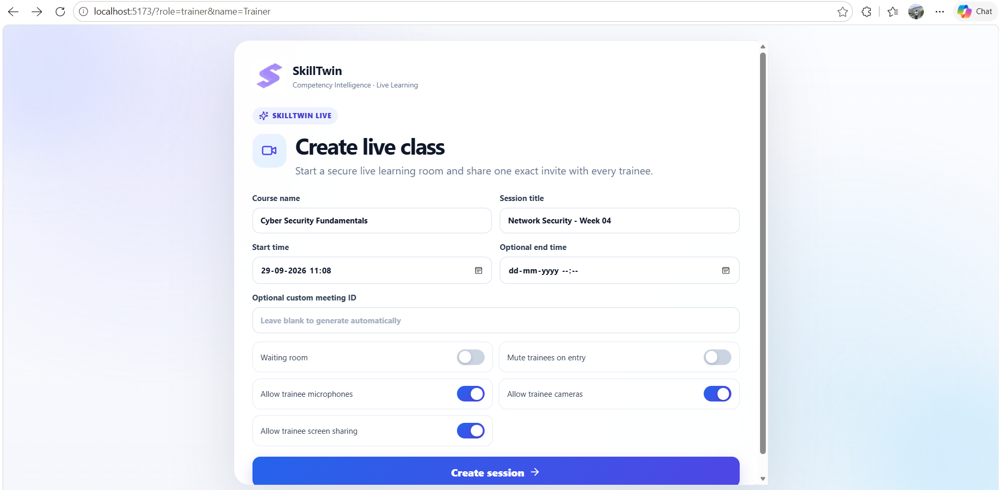
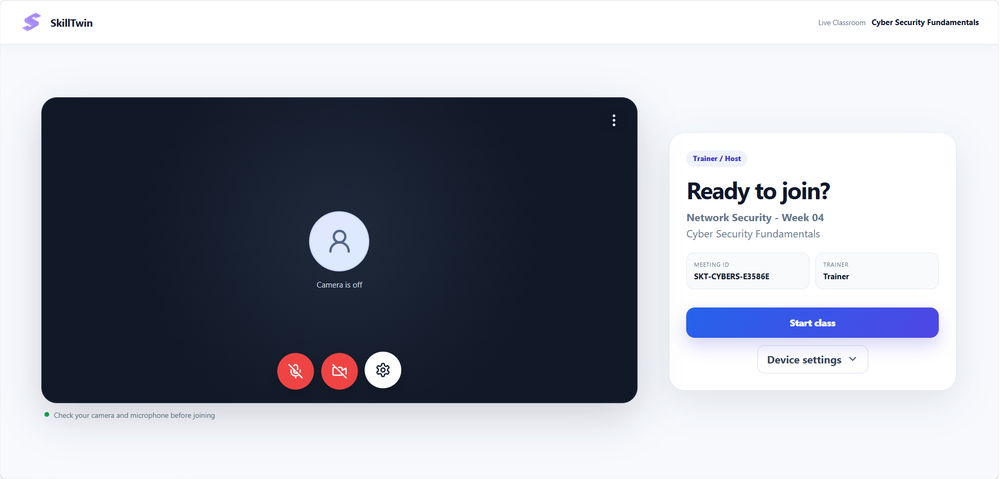
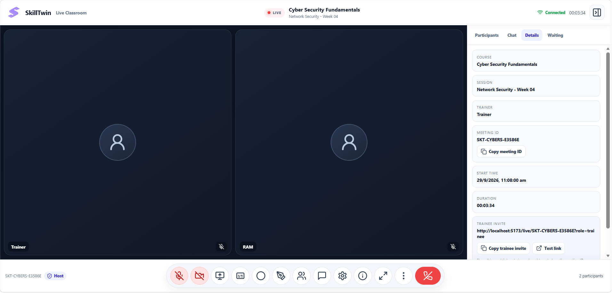
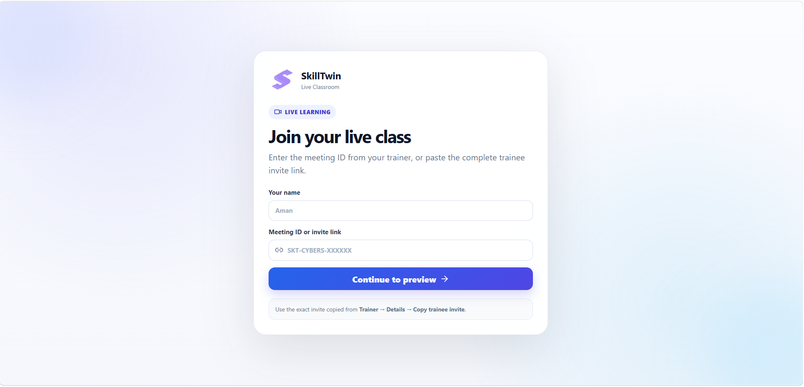
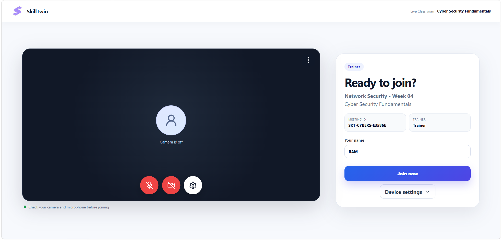
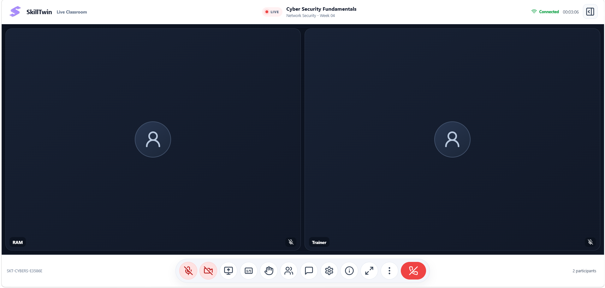
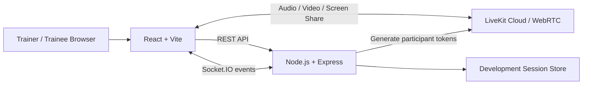

# SkillTwin Live Classroom

> Real-time Trainer–Trainee live classroom module for the SkillTwin learning platform.

SkillTwin Live Classroom is a dedicated live-learning module for the existing SkillTwin LMS. It combines **React + Vite**, **Node.js + Express**, **Socket.IO**, **LiveKit Cloud**, and **WebRTC** to deliver real-time classes with audio, video, screen sharing, moderation, chat, waiting room, and a synchronized whiteboard.

> **Scope:** This repository contains the **Live Classroom module only**. It does not include the complete LMS login/registration, payments, marketplace, admin dashboard, or course-management system.

---

## Tech Stack

| Area | Technology |
|---|---|
| Frontend | React.js, Vite, JavaScript, HTML5, CSS3 |
| Backend | Node.js, Express.js |
| Classroom realtime events | Socket.IO |
| Audio / Video / Screen sharing | LiveKit Cloud, WebRTC |
| UI icons | Lucide React |
| Package management | npm |

---

## Screenshots

### Trainer — Create Live Class



### Trainer — Ready to Join



### Trainer — Live Classroom



### Trainee — Join Live Class



### Trainee — Ready to Join



### Trainee — Live Classroom



---

# Complete Feature Set

## 1. Trainer and Trainee Roles
- Separate Trainer and Trainee experiences.
- Trainer acts as classroom host.
- Trainee joins as participant.
- Trainer is shown as **Trainer / Host**.
- Trainees are shown as **Trainee**.
- Each participant gets a unique identity.

## 2. Live Session Creation
Trainer can configure:
- Course name
- Session title
- Start time
- Optional end time
- Optional custom meeting ID
- Waiting room
- Mute trainees on entry
- Allow trainee microphone
- Allow trainee camera
- Allow trainee screen sharing

If no custom ID is supplied, SkillTwin generates a meeting ID such as `SKT-CYBERS-XXXXXX`.

## 3. Meeting ID and Invite Link
- Unique meeting ID for every class.
- Copy meeting ID.
- Copy Trainee invite link.
- Trainee can join with meeting ID or full invite URL.
- Invite link automatically uses Trainee role.
- Join flow verifies the meeting before continuing.

## 4. Trainee Join Page
Trainee enters:
- Name
- Meeting ID or invite link

Then selects **Continue to Preview**.

## 5. Pre-Join Screen
- Camera preview
- Microphone control
- Camera control
- Device settings
- Meeting information
- Trainer information
- **Start Class** button for Trainer
- **Join Now** button for Trainee

## 6. Camera Controls
- Camera ON / OFF.
- Camera can be re-enabled after disabling it.
- Repeated ON → OFF → ON cycles supported.
- LiveKit camera-state synchronization.
- Camera permission handling.
- Trainer can disable a Trainee camera.
- Trainer can restore camera permission.

## 7. Microphone Controls
- Microphone ON / OFF.
- Re-enable microphone.
- Trainer can mute participant.
- Trainer can disable Trainee microphone.
- Trainer can allow microphone again.
- Trainer can use **Mute All**.

## 8. Live Video Classroom
- Real-time Trainer ↔ Trainee video.
- Real-time audio.
- Multiple participants in one room.
- Responsive participant tiles.
- Local participant identification.
- Trainer / Host identification.
- Participant count.
- Generic avatar when camera is off.

## 9. LiveKit Integration
LiveKit handles:
- Audio
- Video
- WebRTC communication
- Screen sharing
- Participant tracks
- Camera/microphone publishing
- Room connection management

The LiveKit API secret stays on the Node.js backend.

## 10. Secure LiveKit Token Authentication
Backend generates participant tokens using:
- `LIVEKIT_URL`
- `LIVEKIT_API_KEY`
- `LIVEKIT_API_SECRET`

Credential check:
```bash
npm run check:livekit
```
Expected result:
```text
RESULT: VALID
```

## 11. Connection Status
The UI can show:
- Connecting
- Connected
- Reconnecting
- Disconnected
- Connection Error

Useful connection errors are surfaced to the user.

## 12. Screen Sharing / Present Screen
- Trainer can present screen.
- Trainee can present if permission is enabled.
- Browser screen-selection dialog.
- Share browser tab, window, or entire screen.
- Shared content becomes the main stage.
- Camera participants remain in a filmstrip.
- Presenter is identified.
- Stop Presenting.
- Trainer can block Trainee screen sharing.

## 13. Presentation Layout
- Shared content receives priority.
- Camera tiles remain visible.
- Filmstrip layout appears.
- Presenter is clearly identified.
- Presentation can be stopped and restarted.

## 14. Participant Pinning
- Pin participant locally.
- Unpin participant.
- Pinned participant becomes main view.
- Local pinning does not change everyone else's view.

## 15. Spotlight
- Trainer can spotlight a participant.
- Spotlight is classroom-wide.
- Spotlight is separate from local pinning.

## 16. Active Speaker
- Uses LiveKit participant information.
- Active participant can be visually highlighted.

## 17. Participants Panel
Displays:
- Participant name
- Trainer / Trainee role
- Camera state
- Microphone state
- Pin control
- Trainer moderation menu
- Participant search

## 18. Trainer Moderation Controls
Trainer can:
- Mute participant
- Disable microphone
- Allow microphone again
- Disable camera
- Allow camera again
- Block screen sharing
- Allow screen sharing again
- Remove participant
- Allow removed participant to rejoin
- Spotlight participant
- Mute all participants

> Trainer restores permission but does not remotely force another user's camera or microphone ON.

## 19. Waiting Room
When enabled:
- Trainee requests entry.
- Trainer sees pending participant.
- Trainer can Admit or Reject.
- Trainee waits until admitted.

## 20. Lock Class
Trainer can lock the classroom so new participants cannot directly join according to session policy.

## 21. Remove Participant and Allow Rejoin
- Trainer can remove Trainee.
- Removed participant cannot immediately bypass removal.
- Trainer can explicitly allow rejoin.

## 22. Real-Time Chat
- Trainer ↔ Trainee chat.
- Multi-participant chat.
- Socket.IO delivery.
- Sender name.
- Message time.
- Current-session chat history.
- Realtime synchronization.

## 23. Raise Hand
- Trainee can raise hand.
- Trainer sees raised-hand state.
- Trainer can lower hand.

## 24. Meeting Details Panel
Displays:
- Course
- Session title
- Trainer
- Meeting ID
- Start time
- Duration
- Trainee invite link
- Copy meeting ID
- Copy Trainee invite

## 25. SkillTwin Whiteboard
Trainer can:
- Open whiteboard
- Draw with mouse or touch
- Clear whiteboard
- Close whiteboard

Trainee:
- Automatically sees the same whiteboard.
- Sees Trainer drawing in real time.
- Uses the whiteboard in read-only mode.

Whiteboard drawing is synchronized with **Socket.IO**, not screen sharing.

## 26. Whiteboard State Synchronization
Socket.IO events include:
- `whiteboard-state`
- `whiteboard-open`
- `whiteboard-stroke`
- `whiteboard-clear`
- `whiteboard-close`

Late-joining participants can receive the current whiteboard state.

## 27. Realtime Classroom Events
Socket.IO is used for:
- Chat
- Raise hand
- Spotlight
- Moderation events
- Waiting room
- Session policy
- Whiteboard synchronization
- End-class notification

## 28. End Class for Everyone
When Trainer ends class:
- Session ends for all participants.
- LiveKit participants are disconnected.
- Trainer returns to **Create Live Class**.
- Trainee sees **Trainer has ended the class.**

## 29. Leave Class
Trainee can leave independently. Other participants remain in the class. Trainee sees **You left the SkillTwin live class.**

## 30. Session Persistence
Development backend stores session metadata so a simple server restart does not immediately destroy the session metadata. Production should use MySQL, PostgreSQL, MongoDB, Redis, or another persistent store.

## 31. Responsive Design
- Desktop-friendly layout.
- Responsive participant views.
- `100vh` / `100dvh` safe layout.
- Side-panel independent scrolling.
- Meeting controls remain accessible.
- Presentation and participant views stay inside the viewport.

## 32. SkillTwin Theme
- SkillTwin logo.
- White interface.
- Blue / indigo / purple gradient accents.
- Dark video stage.
- Professional learning-oriented layout.
- Consistent buttons and panels.

## 33. Professional Icons
Lucide React icons are used for meeting controls instead of emoji icons.

## 34. Tooltips
Controls can show hover tooltips such as:
- Mute microphone
- Turn camera off
- Present screen
- Participants
- Chat
- Settings
- More
- Leave class

## 35. Generic Avatar
When camera is disabled, a professional generic avatar is shown instead of an emoji.

## 36. Fullscreen
Users can open the classroom in fullscreen mode.

## 37. Device Settings
Users can select:
- Microphone
- Camera

Browser media permissions are supported.

## 38. Session Timer
Ongoing class duration is displayed.

## 39. Participant Count
Total current participants are displayed.

## 40. Error Handling
Handles or reports:
- Camera permission failure
- Microphone permission failure
- Invalid meeting ID
- Backend unavailable
- LiveKit authentication failure
- LiveKit connection failure
- Removed participant
- Ended session
- Session not found

## 41. React Error Boundary
Frontend component failures show a useful error screen instead of a blank white page.

## 42. Backend Health Check
Endpoint:
```text
GET /api/health
```
Example:
```text
http://localhost:3001/api/health
```
It confirms backend status, LiveKit configuration, and LiveKit credential validity.

## 43. Security
- Never place `LIVEKIT_API_SECRET` in React.
- Keep secrets in `server/.env`.
- Do not commit `.env`.
- Commit `.env.example` instead.
- Backend generates LiveKit participant tokens.
- Production role and identity must come from authenticated SkillTwin users.

## 44. Existing LMS Integration
Designed to plug into the existing SkillTwin LMS. Production routes may look like:
```text
/live/:roomName
```
Trainer/Trainee identity should come from the SkillTwin authenticated session rather than query parameters.

---

# Architecture



### Backend Responsibilities
- Create sessions
- Create LiveKit tokens
- Handle moderation
- Handle chat
- Handle waiting room
- Handle whiteboard synchronization
- Handle session events

### LiveKit Responsibilities
- Audio
- Video
- Screen sharing
- Participant media tracks

---

# Project Structure

```text
SkillTwin-Live-Classroom/
│
├── client/
│   ├── src/
│   │   ├── components/
│   │   ├── hooks/
│   │   ├── services/
│   │   ├── App.jsx
│   │   └── styles.css
│   ├── .env.example
│   ├── index.html
│   ├── package.json
│   └── vite.config.js
│
├── server/
│   ├── data/
│   ├── server.js
│   ├── store.js
│   ├── livekit.js
│   ├── check-livekit.js
│   ├── env.js
│   ├── .env.example
│   └── package.json
│
├── docs/
│   └── screenshots/
│
├── package.json
├── README.md
└── .gitignore
```

---

# Installation

```bash
git clone YOUR_REPOSITORY_URL
cd YOUR_PROJECT_FOLDER
npm install
npm run install:all
```

---

# Environment Setup

## `server/.env`

```env
PORT=3001
CLIENT_ORIGIN=http://localhost:5173

LIVEKIT_URL=wss://your-project.livekit.cloud
LIVEKIT_API_KEY=your_api_key
LIVEKIT_API_SECRET=your_api_secret
```

## `client/.env`

```env
VITE_API_URL=http://localhost:3001
```

> Never place real credentials in this README or commit `server/.env`.

---

# LiveKit Setup

1. Create a LiveKit Cloud project.
2. Open **API Keys**.
3. Generate an API key.
4. Copy API Key and API Secret.
5. Copy the Project URL.
6. Add them to `server/.env`.
7. Run:

```bash
npm run check:livekit
```

Expected:
```text
RESULT: VALID
```

---

# Running the Project

```bash
npm run dev
```

Frontend:
```text
http://localhost:5173
```

Backend:
```text
http://localhost:3001
```

Keep the terminal running while the classroom is in use.

---

# Testing Trainer

Development URL:
```text
http://localhost:5173/?role=trainer&name=Trainer
```

1. Create class.
2. Check camera/microphone.
3. Start class.
4. Open **Details**.
5. Select **Copy trainee invite**.

---

# Testing Trainee

Open the copied Trainee invite in:
- Edge
- Chrome Incognito
- Another browser profile

Enter Trainee name and join.

> Query parameters such as `?role=trainer&name=Trainer` are for development/testing only. In production, role and identity must come from SkillTwin authentication.

---

# Backend Health Check

Open:
```text
http://localhost:3001/api/health
```

Example healthy response:
```json
{
  "ok": true,
  "livekitConfigured": true,
  "livekitCredentialsValid": true
}
```

---

# Available Scripts

| Command | Purpose |
|---|---|
| `npm run dev` | Start server and client in development |
| `npm run install:all` | Install server and client dependencies |
| `npm run check:livekit` | Validate LiveKit credentials |
| `npm run build` | Build frontend for production |

---

# Testing Checklist

- [ ] Create session
- [ ] Trainer joins
- [ ] Trainee joins
- [ ] Camera ON/OFF/ON
- [ ] Microphone ON/OFF/ON
- [ ] Trainer → Trainee chat
- [ ] Trainee → Trainer chat
- [ ] Raise hand
- [ ] Lower hand
- [ ] Pin participant
- [ ] Unpin participant
- [ ] Spotlight participant
- [ ] Screen sharing
- [ ] Stop screen sharing
- [ ] Whiteboard opens for Trainer
- [ ] Whiteboard opens for Trainee
- [ ] Trainer drawing appears for Trainee
- [ ] Whiteboard clear synchronizes
- [ ] Disable Trainee camera
- [ ] Allow Trainee camera
- [ ] Disable Trainee microphone
- [ ] Allow Trainee microphone
- [ ] Mute participant
- [ ] Mute all
- [ ] Block Trainee screen sharing
- [ ] Waiting room
- [ ] Admit participant
- [ ] Reject participant
- [ ] Lock class
- [ ] Remove participant
- [ ] Allow rejoin
- [ ] End Class for Everyone
- [ ] Trainee sees Trainer-ended message
- [ ] Trainee can leave independently

---

# Localhost Limitation

`localhost` works only on the same computer.

For another phone/laptop:
- Backend must be reachable on LAN/public URL.
- Frontend must be reachable on LAN/public URL.
- `VITE_API_URL` must use the reachable backend URL.
- `CLIENT_ORIGIN` must match the frontend origin.
- Production should use HTTPS.

---

# Production Deployment

Production should use:
- Public frontend URL
- Public backend URL
- HTTPS
- Environment variables
- Persistent database/session storage
- SkillTwin authentication
- Server-side role validation
- Production CORS configuration
- LiveKit Cloud credentials

Possible options:

| Component | Options |
|---|---|
| Frontend | Vercel |
| Backend | Render, Railway, VPS |
| Realtime media | LiveKit Cloud |
| Persistent storage | PostgreSQL, MySQL, MongoDB, Redis |

---

# Browser Requirements

Recommended:
- Google Chrome
- Microsoft Edge
- Modern Chromium-based browsers

Camera, microphone, screen sharing, and fullscreen require browser permissions.

---

# Why SkillTwin Live Classroom?

- Designed specifically for learning.
- Integrated Trainer/Trainee roles.
- Built-in moderation.
- SkillTwin LMS integration ready.
- Real-time collaboration.
- Secure backend token generation.
- Screen sharing.
- Synchronized interactive whiteboard.
- Classroom chat.
- Waiting room.
- Participant management.

---

# Future Improvements

- Cloud recording with LiveKit Egress
- Automatic captions / speech-to-text
- Collaborative file sharing
- Attendance reports
- Recording history
- Database-backed long-term chat
- Breakout rooms
- Polls and quizzes
- Class analytics
- Full LMS authentication integration
- Calendar scheduling
- Notification system

> These are planned improvements, not claims about current functionality.

---

# Contributing

1. Fork the repository.
2. Create a feature branch.
3. Make and test your changes.
4. Commit your work.
5. Push the branch.
6. Open a pull request.

---

# License

Add your preferred license here.

> Do not claim an MIT or other license unless you intentionally choose it and add the matching license file.

---

# Project

Developed as part of the **SkillTwin** project.

**SkillTwin Live Classroom** — real-time learning, Trainer control, and collaborative classroom communication in one modular live-class experience.
